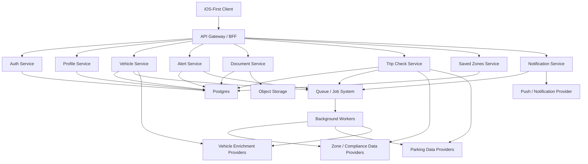

# DriveReady System Architecture

## 1. Objective
Define the production-oriented system architecture for DriveReady so the frontend, backend, storage, background jobs, and real-data integrations can be implemented against one coherent model.

The frontend implementation must remain visually aligned with [driveready-prototype-screens.html](/Users/tayo/Documents/laptop improvements/creating with ai/Digital Trust Product/Testing gpt 5.4/Ideas generation/driveready-prototype-screens.html).

## 2. High-Level Architecture

## 3. Client Architecture

### Client Responsibilities
- Render all screen-based flows from the PRD.
- Preserve the UI structure and component patterns from the prototype.
- Manage local view state, optimistic UI where appropriate, and cached server responses.
- Never call third-party providers directly.
- Render fallback, loading, error, and degraded-data states returned by backend services.

### Client Domains
- Onboarding and auth
- Dashboard
- Garage and vehicle management
- Alerts and reminder preferences
- Document vault
- Trip Check
- Saved zones
- Settings, profile, support

### Client State Boundaries
- Local only:
  - transient form state
  - navigation state
  - temporary UI filters/search text
  - client cache
- Server-backed:
  - account/profile
  - vehicles
  - alerts
  - documents
  - saved zones
  - trip-check history
  - reminder preferences

## 4. Backend Service Boundaries

### API Gateway / BFF
- Single client-facing entry point.
- Handles auth/session verification and request routing.
- Can aggregate domain responses where it materially simplifies the client.
- Enforces consistent response envelopes and error mapping.

### Auth Service
- Sign up
- Sign in
- Sign out
- Password reset
- Session validation
- Token/session lifecycle

### Profile Service
- User profile read/update
- Account preferences
- Notification category preferences

### Vehicle Service
- Vehicle CRUD
- Vehicle enrichment orchestration
- Vehicle status calculation inputs
- Vehicle ownership authorization checks

### Alert Service
- Alert generation and persistence
- Lead-time logic
- Mute/handled state
- Reminder schedule generation

### Document Service
- Document metadata CRUD
- Secure upload initiation/finalization
- Replace/delete logic
- Access control

### Trip Check Service
- Destination lookup
- Zone resolution
- Compliance evaluation for selected vehicle
- Parking recommendation aggregation
- Confidence/freshness calculation
- Trip-check persistence

### Saved Zones Service
- Saved zone CRUD
- Monitoring state
- Route labels and destination presets

### Notification Service
- Notification job creation
- Push provider integration
- Scheduling/cancellation rules
- Delivery event handling if supported

## 5. Storage Architecture

### Relational Database
Use Postgres as the primary operational store for:
- users
- sessions
- vehicles
- documents metadata
- alerts
- saved zones
- trip-check history
- notification preferences
- provider snapshot references

### Object Storage
Use object storage for:
- uploaded files
- document binary assets
- optional derivative files if later required

### Cache Layer
Optional Redis layer for:
- short-lived session cache
- provider response caching
- rate limiting
- queue support if the chosen stack uses Redis-backed jobs

## 6. Data Integration Architecture

### Integration Principles
- Each external provider is wrapped by an adapter.
- Raw provider payloads are never returned directly to the client.
- Normalized internal response models are shared across client and backend.
- Provider failures degrade gracefully and produce explicit fallback states.

### Integration Domains
- Vehicle enrichment
- Charge-zone / compliance evaluation
- Parking recommendations
- Destination/geocoding resolution

### Normalization Rules
- Convert provider-specific field names into internal domain models.
- Map raw compliance values to app statuses:
  - compliant
  - charge_risk
  - unknown
- Map raw parking data into:
  - label
  - price band
  - free/paid
  - walking distance
  - restriction note
  - source
  - freshness
  - confidence

## 7. Background Jobs

### Required Jobs
- Reminder recalculation job
- Alert refresh job
- Provider sync/refresh job
- Notification scheduling job
- Upload finalization or document housekeeping jobs if needed

### Job Design Rules
- Jobs must be idempotent.
- Jobs must support retry policy.
- Failures must be observable.
- Failed jobs must not silently suppress user-critical reminders.

## 8. Key Request Flows

### Auth Flow
1. Client submits credentials to gateway.
2. Gateway routes to auth service.
3. Auth service validates credentials and issues session/token.
4. Gateway returns authenticated response.
5. Client stores session state according to platform rules.

### Vehicle Add Flow
1. Client submits vehicle form.
2. Vehicle service validates registration and required fields.
3. Vehicle service persists vehicle.
4. Optional enrichment adapter runs.
5. Vehicle summary/status is recalculated.
6. Client receives normalized vehicle response.

### Document Upload Flow
1. Client requests upload initiation.
2. Document service creates upload record and storage instructions.
3. Client uploads file through approved path.
4. Client finalizes metadata.
5. Document service stores metadata and returns normalized document object.

### Trip Check Flow
1. Client submits selected vehicle plus destination or saved zone.
2. Trip Check service resolves location input.
3. Trip Check service calls compliance and parking adapters.
4. Adapter responses are parsed and normalized.
5. Trip Check service composes result with confidence/freshness.
6. Result is persisted if user saves it.
7. Client renders a screen-based result view.

### Alert Refresh Flow
1. Vehicle/document changes or scheduled jobs trigger alert recalculation.
2. Alert service evaluates due dates and preferences.
3. New alert state is stored.
4. Notification jobs are enqueued as needed.
5. Client reads fresh alert state from API.

## 9. Security Architecture

### Identity and Access
- Authenticated APIs required for all user data access.
- Per-user authorization required on vehicles, documents, alerts, zones, and trip checks.
- Document file access must be scoped to the owning user.

### Secrets and Credentials
- Provider credentials stored server-side only.
- No provider secret exposed to the client.
- Use environment-scoped secret management.

### Data Protection
- Sensitive user and document metadata stored securely.
- Files stored with non-public access by default.
- Audit logging recommended for destructive document and vehicle actions.

## 10. Reliability and Observability

### Reliability
- Provider calls should use timeout and retry policies.
- Backend should return partial/degraded results rather than failing the whole response where possible.
- Notification scheduling must be resilient to delayed provider refresh.

### Observability
- Structured logs across gateway and domain services.
- Metrics for:
  - auth failures
  - integration failures
  - job failures
  - alert generation volume
  - Trip Check latency
  - document upload failures
- Tracing across gateway -> service -> provider adapter path.

## 11. Environment Strategy

### Development
- Mockable provider adapters
- Shared contracts with production response shapes
- Local file storage alternative

### Staging
- Real service topology
- Limited/sandbox provider access
- Test notification provider configuration

### Production
- Real providers
- Real storage
- Real auth/session enforcement
- Monitoring and alerting enabled

## 12. Frontend / Backend Contract Rules
- The client should rely on stable domain contracts, not provider-specific payloads.
- Every integration-backed result should support:
  - status
  - source
  - freshness
  - optional confidence
- Backend enums must be versioned carefully to avoid client regressions.
- New degraded-data states must be additive and backwards compatible where possible.

## 13. Open Architecture Decisions
- Final provider selection for zone/compliance data
- Final provider selection for parking data
- Session model choice: cookie-backed sessions vs token model
- Queue/job infrastructure choice
- Upload architecture choice: direct-to-storage vs proxied upload

## 14. Architecture Exit Criteria
- Service boundaries are agreed.
- Shared domain contracts are defined.
- Data normalization rules are agreed.
- Trip Check orchestration path is agreed.
- Storage strategy is agreed.
- Security and session model are agreed.
- UI fidelity requirement is explicitly preserved in implementation planning.
